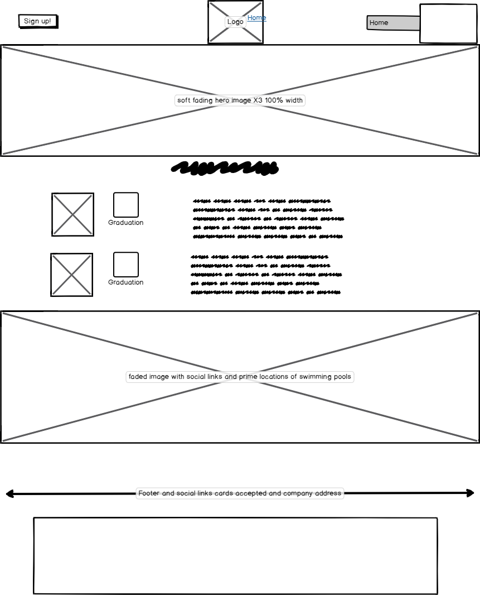
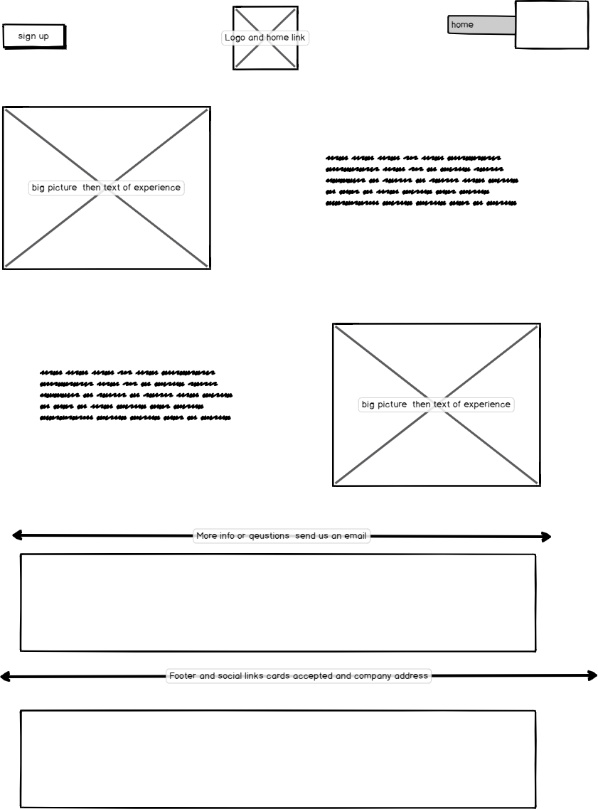
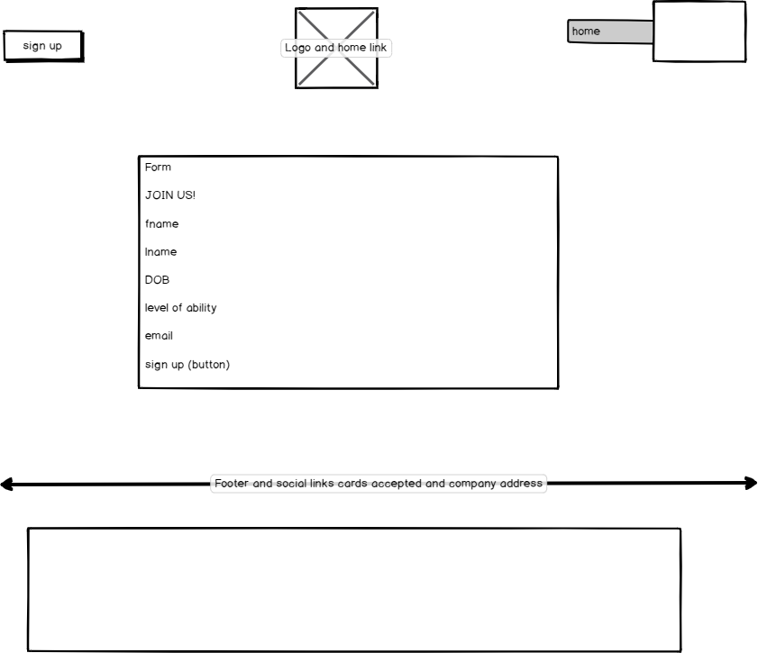

# AH Swim School

This is a startup business in need of a website. This website helps users know where to go to learn or improve their swimming abilities. 
The website will show you that you will be in comfortable hands with the two experienced instructors to lead the journey.
On the Home page it gives you a brief description on the qualifictions that the teachers obtain aswell as times, dates and venues of when
the lessons will be taking place, all the main topics users want to know before they click onto a website and its all on the home page.

You can view the live website here - https://sidhowes.github.io/AH-Swim-School/

## UX

* This website is for people who wish to learn to swim and gives a quick and easy booking system.
* Easy navagation bar to navagate through the different pages to achieve what they want to find out.
* The gallery gives the user a sense of comfort to know that it will be a fun environment.
* The user can simply click on the logo to go back to the home page.
* The user simply inserts there contact information to book onto the lessons.

### **Wireframes** 

### Home page

  

### About Us page 

I adjusted this page slightly to the original plan.

  

### Gallery page

Plan was simple and was always going to be a page just for several pictures.

### Sign Up page 

  

## Features 

* Home page answers the questions users want to know before even clicking onto the website such as: times, dates and venues of 
where this will take place and the individuals teaching the lessons.
* About us page is a description of what they offer and the business objective to make the user feel at ease on what they are 
about to sign up to.
* Gallery page shows easy on the eye images that gives a sense of a fun environment.
* Sign up page is to book onto the lessons by filling out the simple booking form.
* The sign up form also gives feedback if email is entered incorrectly and will not let you submit the form 
until this has been corrected.
* Mobile responsiveness: The website has been designed with both mobile, ipad and desktop users in mind. The layout
of each page differs when viewing from mobile to desktop. 
* Navagation: an easy to navagate bar across the top of the page that also collapses into a hamburger nav bar  when in mobile view.
* External links: Links to **_facebook_** etc with a target = _blank attribute will open up a new tab so users will not have to leave the website.

### Features for the future

* As a future featre I would create the listed venues to be a link with an interactive maps to give a guide oh how to get to the 
different venues.
* A short video clip to show the users what happens during the lessons.
* Fading carousel of pictures for my hero-image.

## Technologies Used

### Languages

* HTML: The language used for the inital content of website.
* CSS: Cascading style sheet language, to style the project (_to make the project come alive_)

### Tools 

* [Bootstrap](https://www.getbootstrap.com/): This website uses bootstrap mainly to create rows and collumns in particular with my footer.
* [Balsamiq wireframes](https://balsamiq.com/) : Used to create the wireframes at the planning UX stage of the project.
* [Github](https://www.github.com/): Used to host the repositories for the website.
* [Google Fonts](https://fonts.google.com/): Used to get fonts used for my text _Lato_ and headings _Sriracha_. 
* [Font Awesome](https://fontawesome.com/) - Used font awesome icons to style the links in the footer and during my home page.
* [jQuery](https://jquery.com/) - jQuery was used within Bootstrap to create the collapsible hamburger nav bar. 
* [W3Cschools css validator](https://jigsaw.w3.org/css-validator/validator) - Validate my css code to make sure there are no errors.
* [W3Cschools html validator](https://validator.w3.org/) - Validate my html code to make sure there are no errors.

## Testing

Using Chrome developer tools throughout the project to test how the the project looks on desktop and on smaller devices i.e
mobile device.
Whenever a change was made I used the selector tool and open up the browser to see that change and to see how it would look.
Another testing method was the inspect selector on the opened browser and although it does not save the changes made while using this 
testing method it is a quick way to see how elements look when moved around.

* Sign up form
  * Tried to submit the form without any information and verified this can not be done.
  * Tried to submit the form with an invalid email adrress and verified this can not be done and a message appears.
  * Tried to submit the form with all relevant information in each correct box and sign up is accepted.

### Problems encoutered when testing

When testing onto smaller devices I found it difficult for elements to do what I wanted them to do. Myself and my mentor
agreed that I over complicated my code and styling and trying to do extra animations and features.
 This will be from a lack of knowledge as I am a beginner in this indusrty and with practice and experience I hope to get
 a better understanding with the code. 
 

## Deployment

My website is hosted on Github pages, following these steps to deploy the website.

### Github pages
1. Navagate to my gitbug respository -  https://github.com/Sidhowes/AH-Swim-School
2. Click on **settings** top right of the page.
3. Scroll down to **Github pages**.
4. click on the dropdown menu of**Source**.
5. Select **master branch**
6. Refresh your page.
7. A green box with a tick is now shown to show that it has been published.

## Credits

### Content

* Code for Navagation collapsible navbar (Hamburger) - [w3schools](https://www.w3schools.com/bootstrap4/bootstrap_navbar.asp)
* Code for the hover over social links on all pages - Code institue mini bootstrap project.
* Code layout and css for my dates, time and venue inspiration from - Code institute mini "Love Running" project.
* CSS styling for my tick sheet - [stack overflow](https://stackoverflow.com/questions/34141950/how-to-use-tick-checkmark-symbol-instead-of-bullets-in-unordered-list)
* Sign Up form with help from - Code institute mini "Love Running" project. 

### Media

* All images used from [Google images](https://www.google.com/search?q=+swimming&tbm=isch&ved=2ahUKEwjEp4qS2ZPqAhXH0YUKHZn1BhkQ2-cCegQIABAA)
  
### Acknowlegements 

* Help and guidance from my mentor _Akshat Grag_.
* inspiration from: 
  * [swim tech](https://www.theswimtech.co.uk/)
  * [aqua tots](https://www.aquatots.com/)

